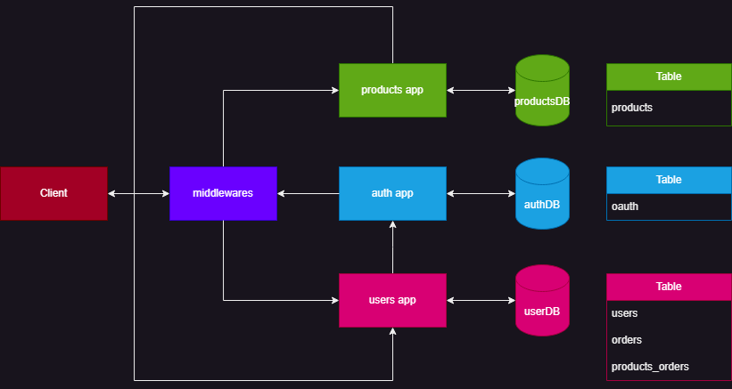
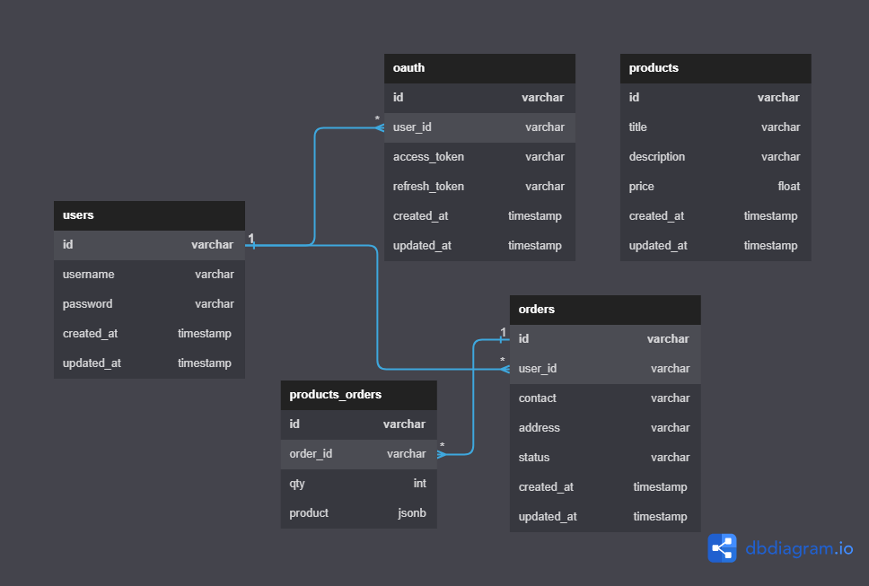

<h1>Neversuitup Microservices E-Commerce Shop</h1>

<h2>✏️ Tasks that have finished (All finish)</h2>
<ul>
    <li>✅ Register</li>
    <li>✅ Login</li>
    <li>✅ Get Profile</li>
    <li>✅ Get Order history of User</li>
    <li>✅ Get All Products</li>
    <li>✅ Get Product Detail</li>
    <li>✅ Create Order</li>
    <li>✅ Cancel Order (Only for 'waiting' status)</li>
    <li>✅ Get Order Detail</li>
</ul>

<h2>🚀 App List</h2>
<ul>
    <li>Users App</li>
    <li>Products App</li>
    <li>Auth App</li>
</ul>

<h2>🌱 Architecture</h2>


<h2>🌱 ER-Diagram</h2>


<h2>Start Project</h2>
<p>***Don't forget to install docker 🐳</p>

<h3>Clone Project</h3>

```bash
git clone https://github.com/Rayato159/neversuitup-e-commerce-test.git
```
```bash
cd neversuitup-e-commerce-test
```
```bash
go get .
```

<h3>Start Database</h3>

<p>Run Database Container</p>

```bash
docker run --name neversuitup_users_db_dev -e POSTGRES_USER=rayato159 -e POSTGRES_PASSWORD=123456 -p 4444:5432 -d postgres:alpine
docker run --name neversuitup_products_db_dev -e POSTGRES_USER=rayato159 -e POSTGRES_PASSWORD=123456 -p 5555:5432 -d postgres:alpine
docker run --name neversuitup_auth_db_dev -e POSTGRES_USER=rayato159 -e POSTGRES_PASSWORD=123456 -p 6666:5432 -d postgres:alpine
```

<p>Config Database</p>

```bash
docker exec -it neversuitup_users_db_dev bash
psql -U rayato159
CREATE DATABASE neversuitup_users_db_dev;
```

```bash
docker exec -it neversuitup_products_db_devt bash
psql -U rayato159
CREATE DATABASE neversuitup_products_db_dev;
```

```bash
docker exec -it neversuitup_auth_db_dev bash
psql -U rayato159
CREATE DATABASE neversuitup_auth_db_dev;
```

<p>Migrate Script</p>
<ul>
    <li><a href="./pkg/database/migrationsUsers">users</a></li>
    <li><a href="./pkg/database/migrationsAuth">auth</a></li>
    <li><a href="./pkg/database/migrationsProducts">products</a></li>
</ul>

<h3>Start App</h3>

<p>Basic Version <strong>(1 Line Per 1 Terminal)</strong></p>

```bash
go run apps/auth/main.go .env.auth.dev
go run apps/authgrpc/main.go .env.auth.grpc.dev
go run apps/users/main.go .env.users.dev
go run apps/usersgrpc/main.go .env.users.grpc.dev
go run apps/products/main.go .env.products.dev
go run apps/productsgrpc/main.go .env.products.grpc.dev
```

<p>🐳 Docker Compose Version</p>

```bash
docker-compose up
```